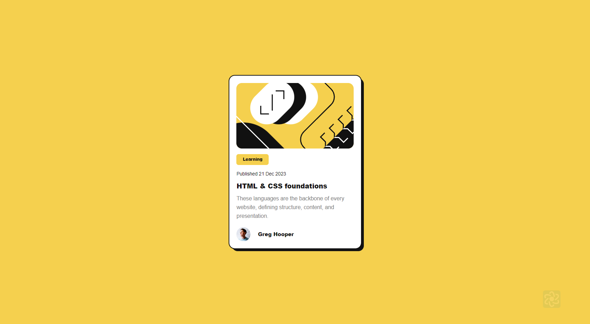

# Blog Card Design

This repository provides the HTML and CSS code to create a stylish blog card similar to the one shown below.

## Features

-   **Rounded Corners**: The card has rounded corners with a border radius.
-   **Shadow**: The card features a shadow that is offset to the left and down.
-   **Responsive Design**: The card is designed to be responsive and look good on various devices.
-   **Clear Typography**: Different font sizes for headings, subheadings, and body text to ensure readability.
